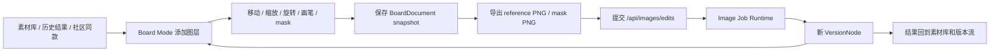

# 20. 多素材多图层画布（Board Mode）改造方案

## 一句话结论

PsyPic 可以引入“可画式 Board Mode（多素材多图层画布）”，但它不应只是一个图片拼贴导出工具。更准确的产品定位是：

> Board Mode 是图片生成前的视觉编排层，也是图片生成后的非破坏性版本快照层。

用户把项目素材、历史结果、参考图、手绘标注、mask 草图和构图意图放到同一个画布里，整理成可提交给 `/api/images/edits` 的参考图或 mask。生成后的结果再回到版本流，成为新的 version node。

这里的“拼图”只是口语。产品定义上，它是一个多素材多图层画布，不只是几张图拼起来导出。

## 调研范围

本轮调研分三类：

- 工作台参考：`desktop-cc-gui`，重点看工作区、面板、全局搜索、任务运行态和文档治理方式。
- 产品参考：Adobe Firefly Boards、Canva Whiteboards、FigJam、Miro AI Canvas 这类视觉白板/创意板。
- 技术参考：Konva / react-konva、Fabric.js、tldraw、Excalidraw。

主要资料：

- `desktop-cc-gui`：https://github.com/zhukunpenglinyutong/desktop-cc-gui
- Adobe Firefly Boards：https://www.adobe.com/products/firefly/boards.html
- Canva Whiteboards：https://www.canva.com/online-whiteboard/
- FigJam：https://www.figma.com/figjam/
- Miro AI：https://miro.com/ai/
- Konva React docs：https://konvajs.org/docs/react/index.html
- Konva serialization / export docs：https://konvajs.org/docs/data_and_serialization/Stage_Data_URL.html
- Fabric.js：https://fabricjs.com/
- Excalidraw React component docs：https://docs.excalidraw.com/docs/@excalidraw/excalidraw/installation
- tldraw docs：https://tldraw.dev/

## 从参考项目学到什么

### desktop-cc-gui 的可迁移点

`desktop-cc-gui` 是 AI coding 工作台，不是图片工具。PsyPic 不应该照搬 Tauri、终端、Git 或代码线程复杂度，但它有几条很适合迁移到图片工作台的产品结构：

- Workspace-first：先有 workspace / project，再有会话、任务、历史和搜索。
- Panel Shell：左侧导航、中间主工作面、右侧 Inspector、底部运行状态是稳定结构。
- Rich Composer：输入区可以承载附件、文件引用、命令和上下文，而不是普通 textarea。
- Runtime mindset：AI 长任务需要可观察状态、取消、失败恢复、日志和结果快照。
- Search / Command Surface：搜索覆盖文件、对话、看板、技能、命令等多类型对象。
- 文档治理：复杂功能用独立 plans/specs 约束边界，避免中心组件无限膨胀。

迁移到 PsyPic 后，对应关系是：

| ccgui 能力 | PsyPic 对应能力 |
| --- | --- |
| Workspace / thread | project / creative session |
| Chat Canvas | Transcript / Board Mode |
| Attachments | image assets / references / masks |
| Kanban / plan panel | batch job / project task dock |
| Runtime log | image job runtime events |
| Global search | project / session / version / asset / board search |
| Skills / prompts | commercial templates / prompt seeds |

### 创意板产品的共同点

Adobe Firefly Boards、Canva Whiteboards、FigJam、Miro 的共同启发不是“画布很大”，而是：

- 画布是创作前的组织空间，用户先摆素材、圈重点、写意图，再生成或协作。
- 图片、文字、手绘、贴纸、框选和连接关系同时存在，表达比单一 prompt 更接近真实创意过程。
- 无限画布对“探索很多方向”有用，但图片生成产品的 MVP 不一定需要无限画布。
- AI 生成的结果可以回到画布继续比较、标注、组合，而不是只进入结果列表。

PsyPic 的第一版应做“项目级多图层画布”，不是做完整白板协作平台。

## 素材库与分类

Board Mode 不是直接拿裸图片乱放，而是先让 AI 和用户素材进入素材库，再从素材库拖入画布。

推荐素材分类：

- `background`：背景、场景底图、氛围图。
- `subject`：主体产品、人像、核心物件。
- `decoration`：装饰、贴纸、边框、小元素。
- `text`：可编辑文字层，不一定是图片素材。
- `text_effect`：烘焙好的字效图或文字风格预设。
- `texture_light`：纹理、颗粒、光效、阴影。
- `shape`：圆角块、线条、标签底、分割块。
- `brand`：logo、品牌色块、VI 元素。
- `reference`：只用于参考的图。
- `mask`：给 AI 编辑用的遮罩素材。

使用方式：

- AI 生成的结果默认先进入最近生成和素材库。
- 用户可以把素材库里的图直接拖到 Board 当一层图片。
- TextLayer 保持可编辑，尽量不要让 AI 把正文文字直接烧进图里。
- `text_effect` 可以作为预设样式，也可以作为独立素材层。
- 用户可在素材库里按分类筛选后拖入画布。

## 技术选型结论

推荐第一版使用 `konva` + `react-konva`。

| 方案 | 当前 npm 信息 | 优点 | 主要问题 | 结论 |
| --- | --- | --- | --- | --- |
| `konva` + `react-konva` | `konva@10.3.0` MIT，`react-konva@19.2.3` MIT | React 绑定成熟，Stage/Layer/Transformer 模型清楚，拖拽、缩放、旋转、导出 PNG 都适合图片工作台 | 高级编辑器能力需要自己组合，例如图层面板、裁剪 UI、历史栈 | 推荐 |
| `fabric` | `fabric@7.3.1` MIT | 对象模型强，图片编辑器传统能力多，导入导出能力成熟 | 更偏命令式对象状态，和现有 React Context / version graph 对接会更别扭 | 备选 |
| `@excalidraw/excalidraw` | `0.18.1` MIT | 草图和白板体验好，集成快 | 图片工作台的图层、精确导出、mask / edit 流水线需要较多绕接 | 不作为主线 |
| `tldraw` | `4.5.10`，npm 显示 `SEE LICENSE IN LICENSE.md` | 完整无限画布和编辑器体验强 | 产品和授权复杂度更高，容易把 PsyPic 带向完整白板/协作产品 | 暂不采用 |

推荐理由：

- PsyPic 已经是 React / Next.js / Context / local-first 工作台，`react-konva` 更容易做受控状态和组件测试。
- Board Mode 的核心是图层、变换、画笔、导出和版本快照，不需要从第一天就拥有完整白板协作能力。
- Konva 的 Stage/Layer 模型和 PsyPic 的 BoardDocument/BoardLayer 模型自然对应。

## 产品定位

Board Mode 应作为 Main Canvas 的一种模式，与 Transcript / Version Stream 并列，而不是隐藏在参数面板里。

```text
Project Sidebar      Main Canvas                         Inspector
项目、会话、素材       Transcript / Board / Version View     参数、图层、画笔、导出、任务
```

核心能力：

- 从素材库、历史结果、社区同款草稿拖入画布。
- 图片层支持移动、缩放、旋转、层级排序、锁定、隐藏。
- 画笔层支持标注、草图、局部编辑提示和 mask 草稿。
- 文本注释支持写 brief、构图说明和保留项。
- 一键扁平化导出 PNG，作为 `/api/images/edits` 的参考图。
- 可选导出 alpha mask PNG，作为 edits 的 `mask` 字段。
- 每次导出或提交都保存 board snapshot，并挂到 version node。

## MVP 范围

### P1：本地 Board Mode

- 新增 Board / Transcript 切换。
- 新建、重命名、删除 board document。
- 从素材库/结果卡添加图片层，支持按分类筛选和拖入。
- 支持选择、拖拽、缩放、旋转、删除、复制、前移/后移。
- 支持画笔、橡皮、颜色、粗细。
- 支持文本注释。
- 支持 undo / redo，第一版可只覆盖 board 内操作。
- BoardDocument local-first 存储在 IndexedDB。

### P2：导出并进入生成链路

- Board 扁平化导出 PNG。
- Board mask 层导出 alpha PNG。
- “作为参考图编辑”把导出 PNG 放入 Composer 的 reference。
- “作为局部编辑 mask”把 alpha PNG 放入 edits 的 `mask`。
- 提交 `/api/images/edits` 后创建新的 version node。
- VersionNode 保存 `board_document_id`、`board_snapshot` 和 `board_export_asset_id`。

### P3：服务端化和搜索

- 新增 `/api/workbench/boards` 系列接口。
- BoardDocument / BoardLayer / BoardExportAsset 入库。
- 搜索支持 board title、annotation text、source asset id、export asset id。
- 版本流可从节点恢复对应 board snapshot。

### P4：高级能力

暂不承诺多人协作。后续可做：

- 多画布页。
- 对齐线和吸附。
- 预设版式模板。
- 智能抠图、背景移除、超分等 utility provider。
- 可选无限画布。

## 对象模型

### BoardDocument

```ts
type BoardDocument = {
  id: string;
  projectId: string;
  sessionId: string;
  title: string;
  width: number;
  height: number;
  background: {
    type: "transparent" | "solid" | "checkerboard";
    color?: string;
  };
  layers: BoardLayer[];
  activeLayerId: string | null;
  sourceVersionNodeIds: string[];
  sourceAssetIds: string[];
  createdAt: string;
  updatedAt: string;
};
```

### BoardLayer

```ts
type BoardLayer =
  | BoardImageLayer
  | BoardStrokeLayer
  | BoardTextLayer
  | BoardMaskLayer;

type BoardBaseLayer = {
  id: string;
  name: string;
  kind: "image" | "stroke" | "text" | "mask";
  visible: boolean;
  locked: boolean;
  opacity: number;
  zIndex: number;
  transform: {
    x: number;
    y: number;
    scaleX: number;
    scaleY: number;
    rotation: number;
  };
};

type BoardImageLayer = BoardBaseLayer & {
  kind: "image";
  assetId: string;
  src: string;
  width: number;
  height: number;
  crop?: { x: number; y: number; width: number; height: number };
};

type BoardStrokeLayer = BoardBaseLayer & {
  kind: "stroke";
  points: number[];
  brush: { color: string; size: number; mode: "draw" | "erase" };
};

type BoardMaskLayer = BoardBaseLayer & {
  kind: "mask";
  points: number[];
  brush: { size: number; mode: "paint" | "erase" };
};
```

### BoardExport

```ts
type BoardExport = {
  id: string;
  boardDocumentId: string;
  projectId: string;
  sessionId: string;
  versionNodeId?: string;
  kind: "reference_png" | "mask_png" | "preview_png";
  assetId: string;
  width: number;
  height: number;
  pixelRatio: number;
  createdAt: string;
};
```

## 工作流



## UI 接入方案

### Main Canvas

- 顶部使用紧凑 tabs：Transcript / Board。
- Board 内部不做营销说明，第一屏就是可操作画布。
- 画布工具条使用图标按钮和 tooltip：选择、平移、画笔、橡皮、文字、裁剪、前移、后移、对齐、导出。
- 图片层被选中时显示 Transformer 控制点。
- 空画布显示素材导入入口和最近结果，不放大段教程。

### Inspector

Board 模式下 Inspector 切换为：

- Layers：图层列表、隐藏、锁定、排序、删除。
- Transform：x/y、宽高、缩放、旋转、不透明度。
- Brush：颜色、粗细、模式。
- Export：导出 reference、导出 mask、作为参考图编辑、作为局部编辑 mask。
- Snapshot：保存快照、从当前 version node 恢复。

### 移动端

- Board 不强求完整桌面能力。
- 移动端第一版支持查看、添加图片、移动缩放、画笔标注和导出。
- 精细图层排序、批量对齐、裁剪参数可收进底部 Sheet。

## API 改造方向

MVP 可以 local-first，不强制新增服务端接口。服务端化时建议新增：

```http
GET /api/workbench/boards?project_id=proj_xxx&session_id=session_xxx
POST /api/workbench/boards
GET /api/workbench/boards/{board_id}
PATCH /api/workbench/boards/{board_id}
POST /api/workbench/boards/{board_id}/export
POST /api/workbench/boards/{board_id}/fork
```

`POST /api/workbench/boards/{board_id}/export` 返回：

```json
{
  "data": {
    "board_export_id": "board_export_xxx",
    "asset_id": "asset_xxx",
    "kind": "reference_png",
    "width": 1536,
    "height": 1024,
    "pixel_ratio": 2
  },
  "request_id": "psypic_req_xxx"
}
```

`/api/images/edits` 不需要知道 Konva 或 BoardLayer。它只接收标准图片文件、mask 文件和工作台上下文字段：

```text
project_id=proj_xxx
session_id=session_xxx
board_document_id=board_xxx
board_export_asset_id=asset_xxx
image=<flattened board png>
mask=<optional alpha png>
prompt=...
```

## 代码边界建议

未来实现时建议新增模块，而不是继续膨胀 `CreatorWorkspace.tsx`：

```text
components/creator/board/
  BoardMode.tsx
  BoardStage.tsx
  BoardToolbar.tsx
  BoardLayerList.tsx
  BoardInspector.tsx
  BoardExportPanel.tsx

lib/creator/board/
  types.ts
  board-store.ts
  board-serialization.ts
  board-export.ts
  board-history.ts
  board-version-link.ts
```

接入点只做装配：

- `CreatorWorkspace` 或 studio shell 只负责切换 `transcript | board`。
- `CreatorStudioContext` 只暴露当前 project/session/version/asset 的必要上下文。
- Board 模块内部管理 canvas 交互和 local snapshot。
- 导出后通过现有 Composer / image edit flow 进入生成链路。

## 风险与缓解

| 风险 | 影响 | 缓解 |
| --- | --- | --- |
| 大图和多图层导致内存高 | 页面卡顿、导出失败 | 限制画布像素、限制图层数、缩略图预览、导出时提示尺寸 |
| 外链图片造成 canvas tainted | 无法导出 PNG | 所有图片先进入 PsyPic asset proxy / object storage，再加载同源 URL |
| 导出质量不稳定 | AI edit 输入模糊或过大 | 使用 `pixelRatio` 控制导出，提供 1x/2x，按 Images API 尺寸规则规整 |
| undo/redo 状态膨胀 | IndexedDB 快照过大 | 保存操作 patch 或节流 snapshot，历史栈设上限 |
| mask 语义混乱 | 用户不知道涂哪里 | 区分 annotation stroke 和 mask layer，mask layer 用独立开关和视觉样式 |
| 移动端手势复杂 | 误触和滚动冲突 | 移动端先做简化工具集，平移/缩放/画笔互斥 |
| 授权和依赖风险 | 后续商业化不确定 | 首选 MIT 的 Konva/react-konva，tldraw 暂不引入 |

## 测试与验收

### 单元测试

- BoardDocument schema 序列化/反序列化。
- layer zIndex 排序、隐藏、锁定、删除。
- export 参数：尺寸、pixelRatio、背景、mask layer 筛选。
- version node 与 board snapshot 的关联。

### 组件测试

- 添加图片层后图层列表出现。
- 选中图片层后显示 transform 控件。
- 拖动/缩放/旋转后 BoardDocument 更新。
- 画笔 stroke 写入 stroke layer。
- mask layer 导出只包含 mask 信息。

### E2E

- 从素材库拖入图片到 Board。
- 添加文字/画笔标注。
- 导出 reference PNG。
- 点击“作为参考图编辑”，Composer 切到图生图模式。
- 提交 edits 后版本流生成新节点，新节点可恢复 board snapshot。

### 视觉检查

- 桌面和移动端 Board 不出现空白 canvas。
- 画布不会被工具条、Composer、Inspector 遮挡。
- 选中框、图标按钮、tooltip 在 light/dark/system 下都可见。
- 导出的 PNG 像素检查非空，尺寸符合预期。

## 推荐落地顺序

1. 文档与模型冻结：先确认 BoardDocument / BoardLayer / BoardExport 语言。
2. local-first 原型：只做本地 Board Mode，不动服务端。
3. 接入素材库和结果卡：图片能进入画布。
4. 接入导出到 edits：画布能成为参考图和 mask。
5. 接入 version node：导出/提交/恢复都有快照。
6. 服务端化：BoardDocument、BoardExportAsset、搜索和权限。

第一版的成败标准很简单：用户能把多张图拼在一起，手绘表达修改意图，一键提交给 AI 编辑，并且这个过程能被版本流保存和恢复。
